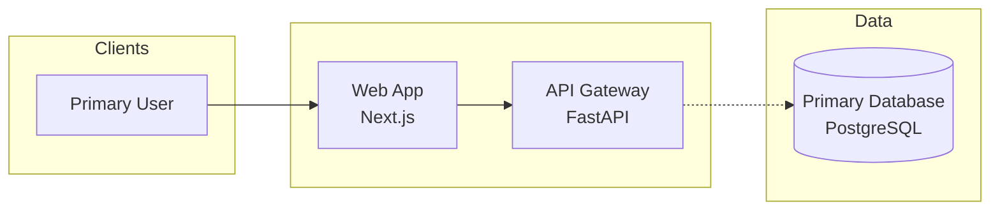

# Containers Overview

> <small>[Architecture Overview](../architecture_overview.md) > <strong>Containers Overview</strong></small>

Capture the full set of runtime containers before drilling into per-container details.

## Purpose
- Describe why this collection of containers exists and how it delivers the system capabilities.
- Highlight the business capabilities or user journeys anchored by this container map.

## Container Inventory
| Container | Technology / Platform | Responsibility | Key Interfaces |
| --- | --- | --- | --- |
| _example: web-app_ | _Next.js_ | _User-facing experience._ | _REST API, Auth, CDN._ |
| _example: auth-service_ | _FastAPI_ | _Identity and session control._ | _PostgreSQL, email provider._ |

Update the rows to reflect the actual containers discovered. Keep responsibilities concise (one to two sentences). Add breadcrumb links to each container's detail page (`./<container-slug>/container_diagram.md`) when listing them.

## Interaction Summary
- Explain the primary collaboration patterns between containers (for example, `web-app` -> `api-gateway` for REST calls).
- Call out data stores or external providers each container depends on.
- Note reliability, scaling, or security boundaries worth reviewing.

## Diagram scaffold
Use a Mermaid flowchart with subgraphs to keep nodes aligned.

````markdown

````

Adjust orientation (`LR` vs `TB`), add additional subgraphs (for example, `External Services`), and label arrows to describe protocols.

## Notes
- Document cross-cutting concerns (observability, compliance, tenancy, resilience).
- Capture outstanding questions, risks, or TODOs for follow-up work.
