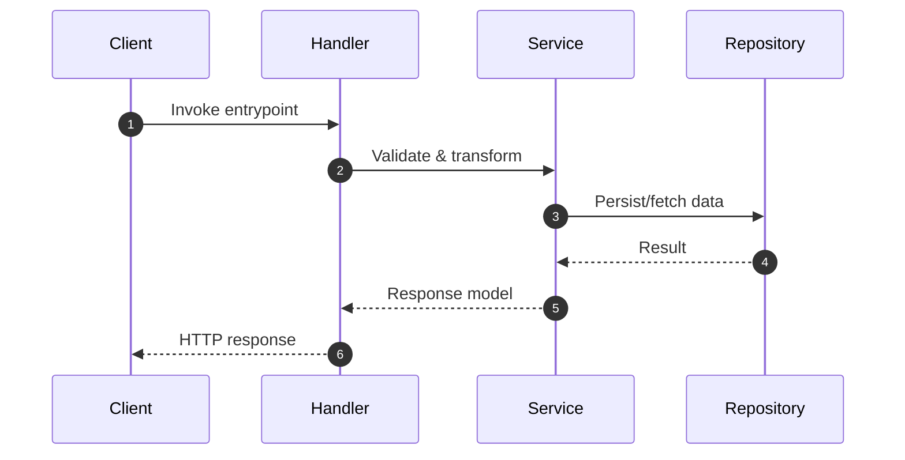

# <component-name> - Component Diagram

> <small>[Architecture Overview](../../../architecture_overview.md) > [Containers Overview](../../../c2_containers/containers_overview.md) > [<container-name>](../../../c2_containers/<container-name>/container_diagram.md) > [Components Overview](../components_overview.md) > <strong><component-name> - Component Diagram</strong></small>

_Replace `<container-name>` and `<component-name>` with the appropriate identifiers._

Document the internal structure, security posture, and runtime interactions of this component.

## Structural View
Use a concise Mermaid **flowchart** (or state diagram) to show the submodules inside the component and how they collaborate. Group related pieces with `subgraph` blocks so the diagram stays readable.

````markdown
```mermaid
flowchart LR
    subgraph <component-name>
        handler[Request Handler]
        service[Domain Service]
        repo[(Repository)]
    end

    handler --> service
    service --> repo
```
````
Replace the placeholders with real classes/modules/packages. Adjust the direction (`LR` vs `TB`) or add additional subgraphs when the component is large.

## Sequence Diagram
Every component entry must also include a Mermaid `sequenceDiagram` that captures a representative interaction across the submodules listed above.

````markdown

````
Tailor participants to real classes/functions and highlight parallel or error paths when helpful.

## Security Considerations
- Identify trust boundaries, authentication/authorisation checks, and data protection requirements handled by this component.
- Document encryption (in transit/at rest), secrets usage, input validation, and monitoring/alerting relevant to security.
- List outstanding risks or TODOs that require mitigation.

## Additional Notes
- Cite key modules/files touched by this component.
- List risks, TODOs, or open design questions.
- Reference tests/metrics that cover the component (include security testing where applicable).

## Linked Code Structure
- Link to the corresponding `c4_code/<component-slug>/code_structure.md` file for this component and a brief description of its organization outside the link.
- If multiple code-structure files exist, enumerate them here and ensure the list stays in sync with the code directory.
