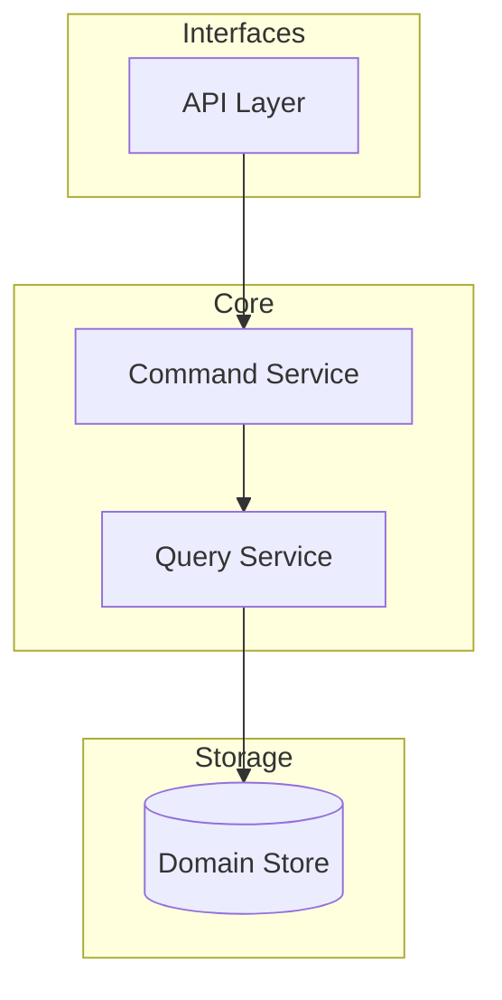
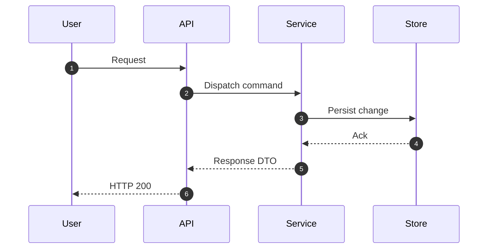

# <container-name> - Components Overview

> <small>[Architecture Overview](../../architecture_overview.md) > [Containers Overview](../../c2_containers/containers_overview.md) > [<container-name>](../../c2_containers/<container-name>/container_diagram.md) > <strong>Components Overview</strong></small>

_Replace `<container-name>` with the actual identifier for this container._

Summarise the internal structure of a specific container before diving into individual component diagrams.

## Purpose
- Explain why this container needs a component breakdown (domain breadth, scaling concerns, ownership).
- Capture the boundaries that separate responsibilities within the container.

## Components
| Component | Responsibility | Key Modules / Packages |
| --- | --- | --- |
| _example: orchestration-service_ | _Coordinates tool execution and conversation state._ | _app/services/orchestration.py, app/utils/tools.py_ |

Replace the placeholder row with the real components uncovered during analysis. Keep responsibilities concise and actionable. Add breadcrumb links to each component's detail page (`./<component-slug>/component_diagram.md`).

## Interaction Summary
- Describe how components collaborate (for example, `orchestration-service` invokes `tool-runner` via internal events).
- Note dependencies on external services, data stores, or other containers.
- Call out extension points, shared libraries, or cross-cutting concerns (auth, caching).

## Structural Diagram
Use a Mermaid flowchart with subgraphs to represent component groupings (adapters, services, stores). Keep nodes aligned by placing them within subgraphs.

````markdown

````

Replace the placeholders with actual components, adjust the orientation (`LR` vs `TB`), and add styles or labels to clarify protocols.

## Sequence Diagram
Include a Mermaid `sequenceDiagram` that captures a representative interaction across the components listed above.

````markdown

````

Tailor the sequence to the container and ensure participants map to the components in the structural diagram.

## Notes
- Document risks (including security posture, threat models, compliance concerns), TODOs, or follow-up analysis required for this container.
- Highlight metrics, alerts, or tests that should accompany the components (call out security coverage and outstanding risks explicitly).
