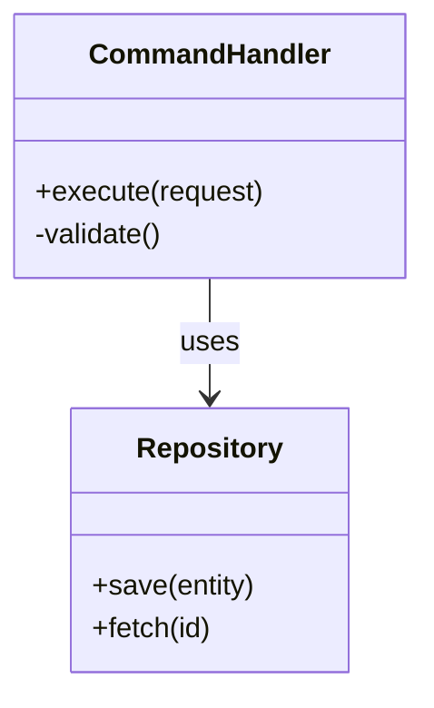
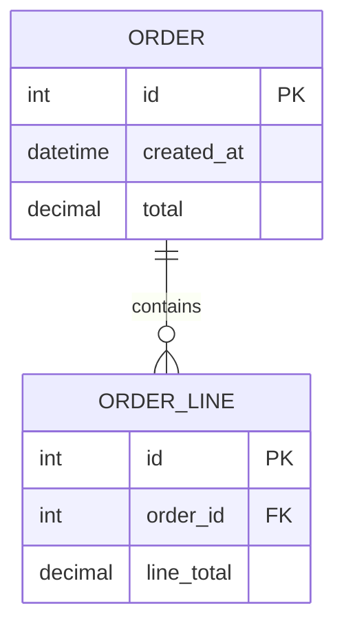

# <component-name> - Code Structure

> <small>[Architecture Overview](../../architecture_overview.md) > [Containers Overview](../../c2_containers/containers_overview.md) > [<container-name>](../../c2_containers/<container-name>/container_diagram.md) > [Components Overview](../../c3_components/<container-name>/components_overview.md) > [<component-name>](../../c3_components/<container-name>/<component-name>/component_diagram.md) > <strong>Code Structure</strong></small>

_Replace `<container-name>` and `<component-name>` with the appropriate identifiers._

Use this guidance when documenting code-level structures surfaced during the architecture analysis.

## What to cover
- **Purpose**: explain why this level of detail is relevant (e.g., critical domain services, shared libraries).
- **Scope**: state which modules, packages, or bounded contexts are included.
- **Key structures**: table describing important classes, modules, packages, or namespaces.
- **Diagram**: Mermaid `classDiagram` (or `flowchart` when more suitable) that captures modules, classes, and relationships. Avoid `C4Code` which is unsupported.
- **Notes**: coding conventions, extension mechanisms, technical debt, or hotspots observed in the codebase.

## Diagram scaffold
````markdown

````

Add packages with `namespace` or group classes into subgraphs when the diagram becomes large. Prefer association labels to describe the dependency type.
## Database Schema
Provide a concise view of the database structures touched by this component. Use Mermaid `erDiagram` (or a tabular summary) to show tables/collections, key columns, and relationships.

````markdown

````

Document indexes, constraints, and migrations that are relevant for this component.

## Quality checklist
- Key abstractions have clear responsibility statements.
- Relationships convey direction (imports, inheritance, data flow) to show how code pieces interact.
- Notes capture risks (tight coupling, lack of tests) and next steps for maintainability.
- Database schema impact is documented (tables, relationships, constraints) where applicable.
- Security implications (secret handling, sensitive data, threat mitigations) are recorded alongside code decisions.
- Diagram renders without syntax errors (verify via Mermaid CLI or mermaid.live).
