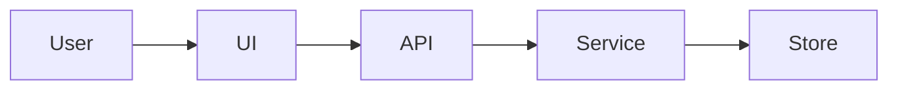
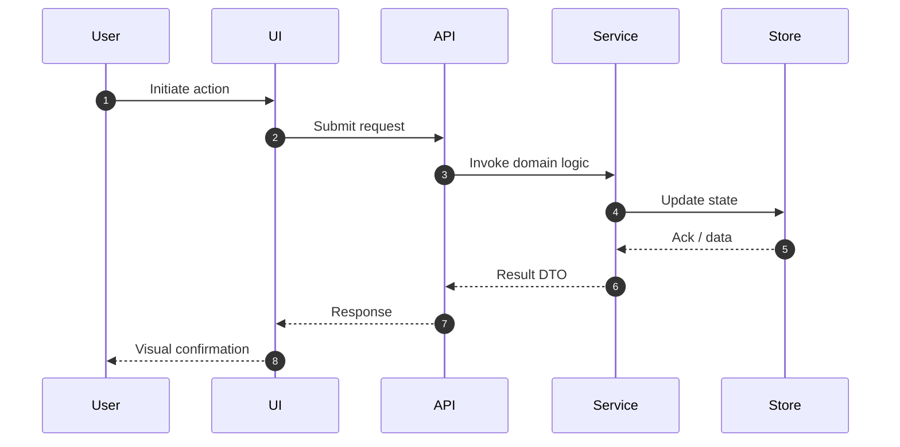

# Dynamic View

> <small>[Architecture Overview](../architecture_overview.md) > <strong>Dynamic View</strong></small>

Guidance for documenting a key runtime scenario or workflow. If the flow focuses on a particular container/component, add additional breadcrumb links to those artefacts.

## Context Summary
- Describe the business scenario or user goal the flow represents.
- Clarify start and end conditions plus the systems or components involved.

## Interaction Map
Use a Mermaid flowchart to highlight the major steps before detailing the sequence. This helps keep actors aligned visually.

````markdown

````
Update nodes and edges to reflect the actual scenario, grouping related actors via subgraphs when necessary.

## Sequence Diagram
Every dynamic view must include a detailed `sequenceDiagram` that mirrors the interaction map.

````markdown

````
Highlight parallel flows or error paths when applicable.

## Notes
- Latency expectations, failure handling, concurrency considerations, or TODOs.
- Monitoring / alerting hooks that should observe this flow.
- Security checkpoints (auth boundaries, sensitive data exposure, abuse prevention) triggered within this flow.
