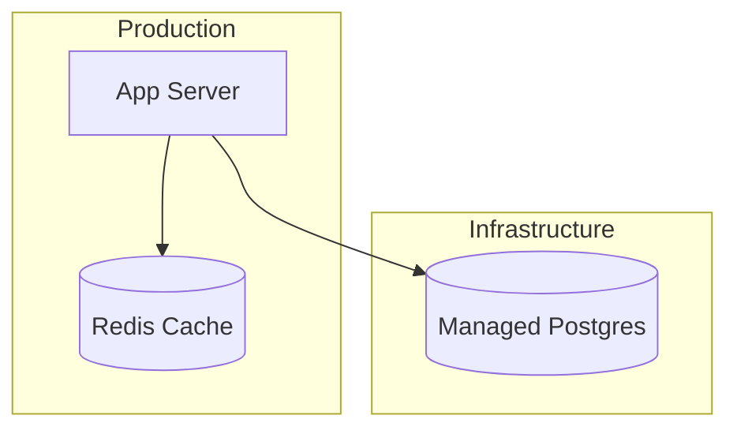

# Deployment View

> <small>[Architecture Overview](../architecture_overview.md) > <strong>Deployment View</strong></small>

Guidance for capturing how the system is deployed to infrastructure.

## What to cover
- **Purpose**: describe deployment objectives (resilience, compliance, latency, cost).
- **Scope**: list the environments or regions covered plus any major hosting platforms.
- **Environments table**: nodes, clusters, or services with their role/purpose.
- **Diagram**: Mermaid `flowchart` using subgraphs per environment to avoid syntax errors from unsupported C4 keywords.
- **Notes**: scaling strategy, failover, secrets management, observability, or compliance controls.

## Diagram scaffold
````markdown

````
Add networking layers or security groups as additional nodes/subgraphs. Use descriptive labels so reviewers understand regions and responsibilities.

## Quality checklist
- Every runtime container from C2 appears in the deployment view with its host infrastructure.
- Connections indicate protocols/ports/security boundaries between nodes.
- Diagram renders cleanly (no lexical errors); adjust indentation and remove stray characters if Mermaid reports issues.
- Notes outline operational responsibilities and open issues.
